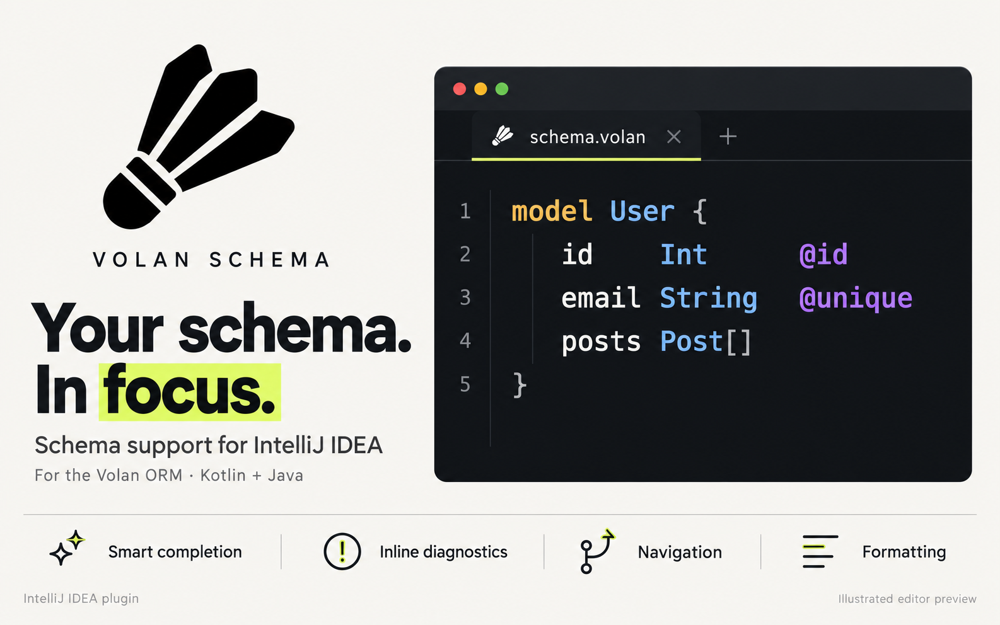
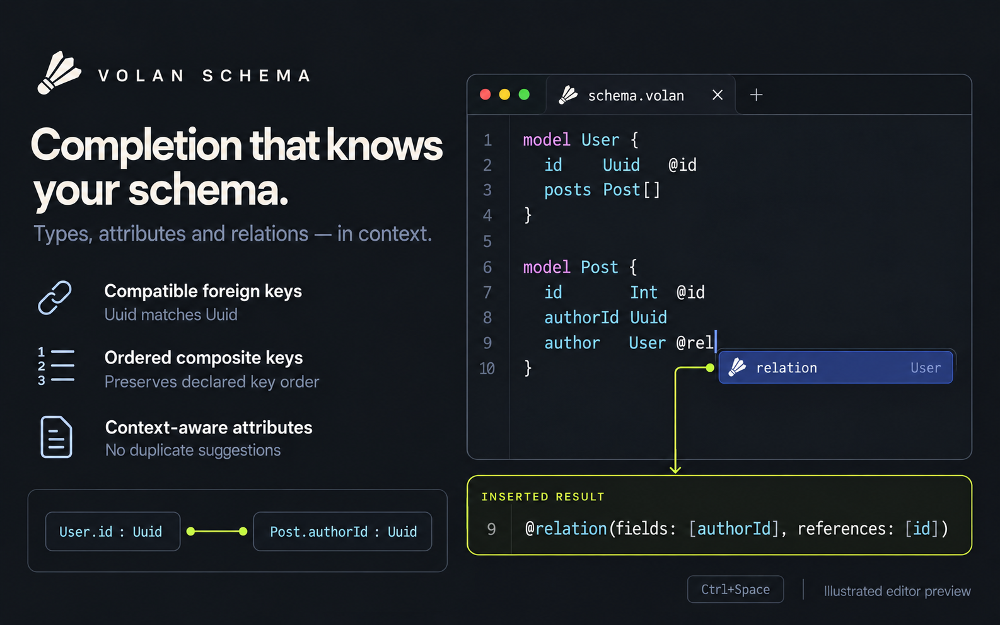
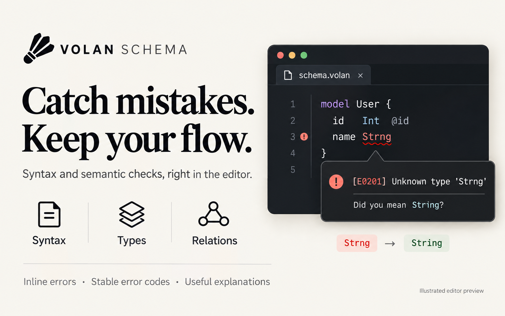
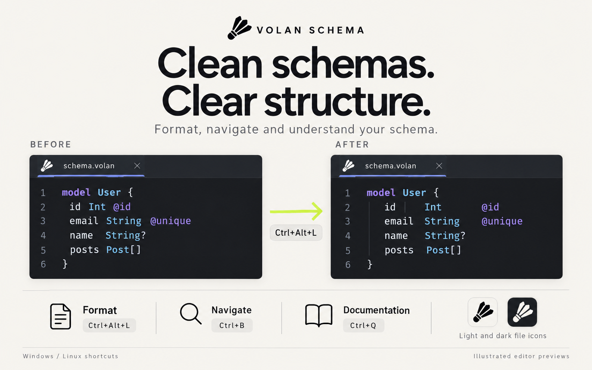

# Volan Schema — Marketplace gallery

Четыре готовых PNG, каждый **1586 × 992** пикселя. Минимум 1200 × 760 соблюдён.
Светлые и тёмные баннеры объединены логотипом волана, крупной типографикой,
примерами схем и акцентами лаймового цвета. Текст — на английском.

Рекомендуемый порядок загрузки в галерею:

| Файл | Содержание |
| --- | --- |
| [01-overview.png](01-overview.png) | Обзор: логотип, код, четыре возможности плагина |
| [02-smart-completion-v2.png](02-smart-completion-v2.png) | Дополнение связей, совместимые ключи, вставка `@relation` |
| [03-diagnostics.png](03-diagnostics.png) | Подсветка опечатки `Strng`, код E0201 и пояснение ошибки |
| [04-formatting-navigation.png](04-formatting-navigation.png) | Форматирование до/после, навигация, документация, иконки двух тем |

Изображения созданы встроенным **image_gen** с исходным логотипом
из [logo-original.png](../logo-original.png). Примеры представляют иллюстрированные
превью редактора. Возможности, типы, атрибуты и сочетания клавиш сверены с плагином.

Полный набор промптов и точечная правка дополнения: [prompts.json](prompts.json).
Размеры файлов и SHA-256: [manifest.json](manifest.json).

